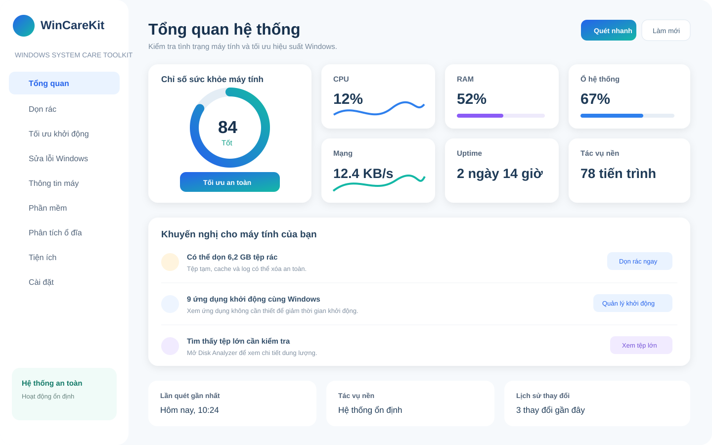

# WinCareKit Design System — Source of Truth

This directory is the visual source of truth for every WinCareKit UI/UX implementation.

## Approved visual references
- [WinCareKit logo](./wincarekit-logo.svg)
- [Overview reference](./wincarekit-overview-reference.svg)

## Implementation stack
- C# / .NET
- WPF
- MVVM
- Shared ResourceDictionary + reusable controls/templates

## Design system rules

### Semantic color tokens
Use semantic names, never page-specific raw colors:
- BrandPrimary: #2563EB
- BrandCyan: #22B8F0
- BrandTeal: #14B8A6
- SurfaceApp: #F6F9FC
- SurfaceCard: #FFFFFF
- TextPrimary: #18324E
- TextSecondary: #75879A
- BorderSubtle: #DDE6EF
- Success, Warning, Danger and Info must be semantic tokens with light/dark variants.

### Typography
Use Segoe UI as the default Windows typeface. Define shared styles for:
- Display/Page title
- Section title
- Card title
- Body
- Caption
- Metric value
No page may invent its own font size/weight combination when an existing typography token applies.

### Spacing
Use a 4px base grid. Shared spacing tokens should cover 4, 8, 12, 16, 20, 24, 32, 40 and 48 px. Pages compose these tokens; do not hardcode arbitrary gaps.

### Radius and elevation
Use a small, controlled radius scale. Cards and dialogs must use shared radius/elevation tokens. Avoid heavy blur/drop shadows.

### Component hierarchy
AppShell -> Sidebar + PageHost
Page -> PageHeader + Sections
Section -> Card/Grid/List
Actions -> shared Button/Toggle/Badge/Dialog/Progress components

### Required reusable components
- AppShell
- SidebarNavigation
- PageHeader / CommandBar
- Card
- MetricCard
- StatusBadge / RiskBadge
- Toggle
- Primary / Secondary / Destructive Button
- VirtualizedDataList
- ProgressDialog
- ConfirmationDialog
- Toast / InlineError
- EmptyState / LoadingState / UnsupportedState
- Chart/Sparkline wrapper with bounded history

### Layout rules
- Baseline desktop: 1366x768
- Must scale through Full HD, 2K and DPI 100–200%
- Sidebar, content margins and card spacing are shared tokens
- Avoid deep visual trees and repeated nested Border/Grid/StackPanel chains
- Lists with large item counts must enable virtualization and recycling

### State model
Every data/action page must define:
Idle/Loading -> Ready/Empty/Error/Unsupported
and when applicable:
Scanning/Running -> Completed/PartialFailure/Cancelled

### MVVM boundary
- No business/system logic in code-behind.
- ViewModel depends on application contracts, never Win32/WMI/Registry directly.
- View code-behind is limited to view-only behavior that cannot be expressed cleanly in XAML.

### Performance
- No unbounded ObservableCollection growth.
- No unlimited chart history.
- Lazy-load icons/images.
- Bounded image/icon cache.
- Throttle/coalesce high-frequency progress and metric updates.
- Dispose timers, subscriptions and native resources on lifecycle end.
- Avoid continuous decorative animations.

### Definition of done for UI issues
A UI issue is not complete until:
1. It follows the approved visual references.
2. It uses design tokens rather than local hardcoded styles.
3. Repeated patterns use shared components.
4. Loading/error/empty/permission states are implemented.
5. Keyboard/DPI/accessibility behavior is checked.
6. No obvious UI-thread, virtualization or memory regression is introduced.
